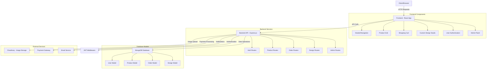

# PrintCraft - Custom T-Shirt Printing E-commerce Platform


[](https://nodejs.org/)
[](https://reactjs.org/)
[](https://mongodb.com/)
[](https://expressjs.com/)

## 🚀 Project Overview

PrintCraft is a full-stack e-commerce platform specializing in custom t-shirt printing and apparel. The platform allows users to browse products, customize designs, manage orders, and provides comprehensive administrative tools for business management.

## 📊 System Architecture Flowchart



## 🏗️ Technology Stack

### Frontend
- **React 18.3.1** - Component-based UI library
- **React Router DOM 7.6.3** - Client-side routing
- **Vite 5.4.2** - Fast build tool and development server
- **Tailwind CSS 3.4.1** - Utility-first CSS framework
- **Lucide React 0.344.0** - Icon library
- **Axios 1.10.0** - HTTP client for API requests

### Backend
- **Node.js** - JavaScript runtime environment
- **Express.js 4.21.2** - Web application framework
- **MongoDB with Mongoose 8.3.2** - NoSQL database and ODM
- **JWT (jsonwebtoken 9.0.2)** - Authentication tokens
- **bcryptjs 2.4.3** - Password hashing
- **Cloudinary 2.2.0** - Cloud-based image management
- **Multer 1.4.5** - File upload middleware

### Security & Performance
- **Helmet.js 7.1.0** - Security headers
- **CORS 2.8.5** - Cross-origin resource sharing
- **Express Rate Limit 7.2.0** - API rate limiting
- **dotenv 16.4.5** - Environment variable management

## 📋 Features

### 🛍️ E-commerce Functionality
- **Product Catalog**: Browse various apparel categories (T-shirts, Hoodies, Tank tops, etc.)
- **Size & Color Selection**: Multiple size options (XS-XXXL) and color variants
- **Shopping Cart**: Add/remove items, quantity management
- **Order Management**: Complete order lifecycle with tracking
- **User Profiles**: Customer account management with order history

### 🎨 Custom Design Features
- **Design Studio**: Custom design creation interface (Coming Soon)
- **Image Upload**: Support for custom artwork and logos
- **Design Templates**: Pre-made design options
- **Text Editor**: Custom text with various fonts and styles
- **Print Area Management**: Defined printing zones for each product

### 👥 User Management
- **Authentication System**: Secure login/registration with JWT
- **Role-based Access**: Customer and Admin roles
- **Profile Management**: User details, addresses, and preferences
- **Order Tracking**: Real-time order status updates

### 🔧 Admin Panel
- **Product Management**: CRUD operations for products
- **Order Processing**: Order status updates and management
- **User Administration**: User account management
- **Analytics Dashboard**: Business insights and reporting
- **Inventory Management**: Stock tracking and management

## 📁 Project Structure

```
PrintCraft/
├── 📁 backend/
│   ├── 📁 middleware/
│   │   └── auth.js                 # JWT authentication middleware
│   ├── 📁 models/
│   │   ├── User.js                 # User data model
│   │   ├── Product.js              # Product data model
│   │   ├── Order.js                # Order data model
│   │   └── Design.js               # Design data model
│   ├── 📁 routes/
│   │   ├── auth.js                 # Authentication endpoints
│   │   ├── products.js             # Product management endpoints
│   │   ├── orders.js               # Order management endpoints
│   │   ├── designs.js              # Design management endpoints
│   │   └── admin.js                # Admin panel endpoints
│   ├── .env.example                # Environment variables template
│   ├── package.json                # Backend dependencies
│   └── server.js                   # Express server configuration
├── 📁 src/
│   ├── 📁 components/
│   │   ├── 📁 common/
│   │   │   ├── Header.jsx          # Navigation component
│   │   │   ├── Footer.jsx          # Footer component
│   │   │   ├── Hero.jsx            # Hero section component
│   │   │   └── CartPopup.jsx       # Shopping cart popup
│   │   └── 📁 products/
│   │       └── ProductGrid.jsx     # Product display grid
│   ├── 📁 context/
│   │   ├── AuthContext.jsx         # Authentication state management
│   │   └── CartContext.jsx         # Shopping cart state management
│   ├── 📁 pages/
│   │   ├── Login.jsx               # Login page
│   │   ├── Register.jsx            # Registration page
│   │   ├── Cart.jsx                # Shopping cart page
│   │   ├── ProductDetail.jsx       # Product details page
│   │   ├── CustomDesign.jsx        # Design studio page
│   │   ├── Orders.jsx              # Order history page
│   │   ├── Profile.jsx             # User profile page
│   │   ├── Admin.jsx               # Admin dashboard
│   │   ├── About.jsx               # About page
│   │   ├── FAQ.jsx                 # FAQ page
│   │   └── HowItWorks.jsx         # How it works page
│   ├── App.jsx                     # Main application component
│   ├── main.jsx                    # Application entry point
│   └── index.css                   # Global styles
├── package.json                    # Frontend dependencies
├── tailwind.config.js              # Tailwind CSS configuration
├── vite.config.ts                  # Vite configuration
└── README.md                       # Project documentation
```

## 🗄️ Database Schema

### User Model
- Personal information (firstName, lastName, email)
- Authentication (password with bcrypt hashing)
- Role-based access (customer/admin)
- Address and contact information
- Order references and account status

### Product Model
- Product details (name, description, category)
- Pricing and inventory management
- Size and color variants with stock tracking
- Image gallery and mockup images
- Print area specifications
- Material and care instructions

### Order Model
- Order tracking with unique order numbers
- Item details with customization options
- Shipping and billing information
- Payment processing status
- Order status workflow
- Delivery tracking information

### Design Model
- Custom design metadata
- File storage references
- User associations
- Design specifications

## 🚦 API Endpoints

### Authentication
- `POST /api/auth/register` - User registration
- `POST /api/auth/login` - User login
- `GET /api/auth/profile` - Get user profile
- `PUT /api/auth/profile` - Update user profile

### Products
- `GET /api/products` - Get all products
- `GET /api/products/:id` - Get specific product
- `POST /api/products` - Create product (Admin)
- `PUT /api/products/:id` - Update product (Admin)
- `DELETE /api/products/:id` - Delete product (Admin)

### Orders
- `GET /api/orders` - Get user orders
- `POST /api/orders` - Create new order
- `GET /api/orders/:id` - Get specific order
- `PUT /api/orders/:id` - Update order status

### Designs
- `GET /api/designs` - Get user designs
- `POST /api/designs` - Upload new design
- `GET /api/designs/:id` - Get specific design
- `DELETE /api/designs/:id` - Delete design

### Admin
- `GET /api/admin/users` - Get all users
- `GET /api/admin/orders` - Get all orders
- `PUT /api/admin/orders/:id` - Update order status
- `GET /api/admin/stats` - Get business analytics

## 🛠️ Installation & Setup

### Prerequisites
- Node.js 18+
- MongoDB 6+
- npm or yarn package manager

### Backend Setup
```bash
# Navigate to the backend directory
cd backend

# Install dependencies
npm install

# Create environment file
cp .env.example .env

# Edit .env with your configuration
# - MONGODB_URI
# - JWT_SECRET
# - CLOUDINARY credentials
# - Other environment variables

# Start the backend server
npm run dev
```

### Frontend Setup
```bash
# Navigate to the root directory
cd PrintCraft

# Install dependencies
npm install

# Start the development server
npm run dev
```

### Environment Variables
Create a `.env` file in the backend directory:
```env
PORT=5000
MONGODB_URI=mongodb://localhost:27017/printcraft
JWT_SECRET=your_super_secret_jwt_key
JWT_EXPIRE=30d
FRONTEND_URL=http://localhost:5173
CLOUDINARY_CLOUD_NAME=your_cloudinary_name
CLOUDINARY_API_KEY=your_cloudinary_key
CLOUDINARY_API_SECRET=your_cloudinary_secret
NODE_ENV=development
```

## 🚀 Deployment

### Production Build
```bash
# Build frontend for production
npm run build

# Start backend in production mode
npm run server
```

### Docker Deployment (Optional)
```dockerfile
# Example Dockerfile structure
FROM node:18-alpine
WORKDIR /app
COPY package*.json ./
RUN npm ci --only=production
COPY . .
EXPOSE 5000
CMD ["npm", "start"]
```

## 📈 Future Enhancements

### Planned Features
- [ ] Complete Custom Design Studio implementation
- [ ] Payment gateway integration (Stripe/PayPal)
- [ ] Email notifications and marketing
- [ ] Advanced analytics dashboard
- [ ] Mobile app development
- [ ] AI-powered design recommendations
- [ ] Multi-language support
- [ ] Advanced inventory management
- [ ] Customer reviews and ratings system
- [ ] Social media integration

### Technical Improvements
- [ ] Implement comprehensive testing (Jest, Cypress)
- [ ] Add TypeScript support
- [ ] Implement caching strategies (Redis)
- [ ] Add comprehensive logging system
- [ ] Implement CI/CD pipeline
- [ ] Add monitoring and error tracking
- [ ] Optimize database queries
- [ ] Implement microservices architecture

## 🤝 Contributing

1. Fork the repository
2. Create a feature branch (`git checkout -b feature/AmazingFeature`)
3. Commit your changes (`git commit -m 'Add some AmazingFeature'`)
4. Push to the branch (`git push origin feature/AmazingFeature`)
5. Open a Pull Request

## 📄 License

This project is licensed under the MIT License - see the [LICENSE.md](LICENSE.md) file for details.

## 👥 Team

- **Development Team**: Full-stack development and architecture
- **UI/UX Design**: User interface and experience design
- **DevOps**: Deployment and infrastructure management

## 📞 Support

For support, email support@printcraft.com or join our Slack channel.

---

**Built with ❤️ by the PrintCraft Team**

*Last updated: January 2025*
